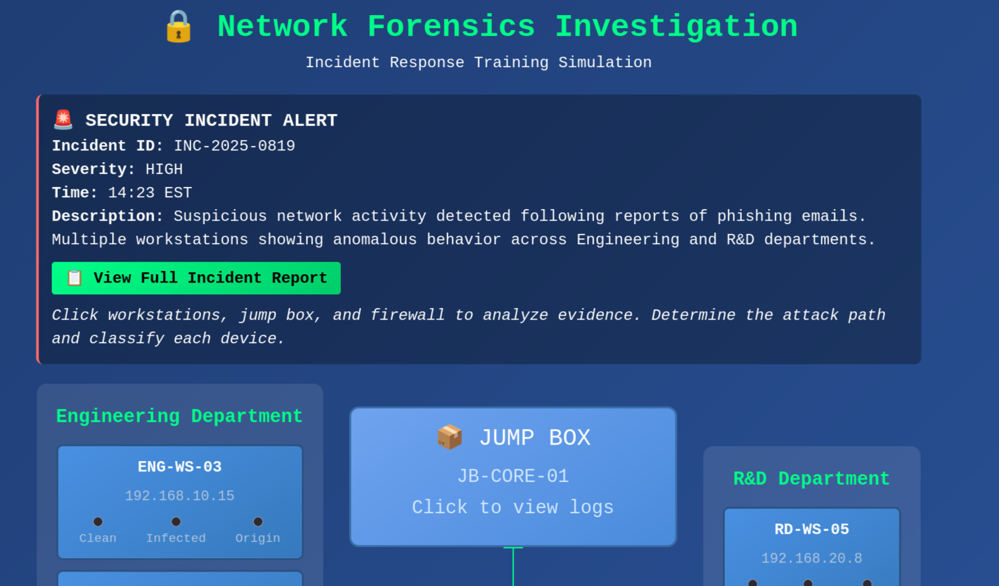

# Network Forensics Investigation Simulator

A React/TypeScript web application that recreates a Security+ performance-based question I encountered for cybersecurity training. This simulator presents users with an incident response scenario where they must analyze forensic evidence to identify compromised systems and trace attack paths.



## 🎯 Project Overview

This simulator demonstrates understanding of:
- **Incident Response Methodology** - Following proper forensic analysis procedures
- **Attack Vector Recognition** - Identifying phishing, lateral movement, and persistence techniques
- **Network Forensics** - Analyzing logs, traffic patterns, and system artifacts
- **Threat Hunting** - Correlating evidence across multiple systems

## 🚨 Attack Scenario

The simulation presents a realistic corporate breach:

1. **Initial Compromise** - Phishing email targets Engineering department
2. **Credential Harvesting** - Malicious link steals user credentials
3. **Lateral Movement** - Attacker pivots through jump box to R&D network
4. **Data Exfiltration** - Attempted theft of proprietary research data


## 🔍 Technical Features

### Architecture
- **React 18** with TypeScript for type safety
- **Component-based design** with clear separation of concerns
- **Custom CSS** with cybersecurity-themed styling
- **Modal system** for detailed forensic log analysis

### Forensic Evidence
- **Vulnerability scan results** with subtle compromise indicators
- **System event logs** requiring timeline correlation
- **Network traffic analysis** showing C2 communications
- **Jump box authentication logs** revealing lateral movement
- **Firewall logs** with blocked exfiltration attempts


## 🏗️ Component Structure

```
src/
├── components/
│   ├── Network/           # Main network topology
│   ├── Departments/       # Engineering & R&D workstation groups
│   ├── JumpBox/          # Network pivot point
│   ├── Firewall/         # Network traffic analysis
│   ├── Modal/            # Log display system
│   └── Results/          # Professional SOC-style reporting
├── data/
│   ├── devices.ts        # Network device definitions
│   └── answers.ts        # Forensic logs and correct classifications
└── types/
    └── index.ts          # TypeScript interfaces
```

## 🎮 How to Use

1. **Read the incident alert** - Understand the security event context
2. **Analyze forensic evidence** - Click workstations, jump box, and firewall to view logs
3. **Classify each system** - Determine if devices are Clean, Infected, or Origin point
4. **Submit analysis** - Receive detailed feedback on forensic accuracy


## 🎯 Learning Objectives

This simulator teaches:
- **Evidence correlation** - Linking timestamps across multiple log sources
- **Attack pattern recognition** - Identifying phishing, persistence, and lateral movement
- **Network forensics** - Understanding traffic flows and segmentation bypasses
- **Incident classification** - Distinguishing between compromise indicators and normal activity

## 🚀 Getting Started

### Prerequisites
- Node.js 18+
- npm or yarn

### Installation

```bash
# Clone the repository
git clone https://github.com/CaziahDevs/network-forensics.git
cd network-forensics

# Install dependencies
npm install

# Start development server
npm run dev
```

Visit `http://localhost:5173` to access the simulator.

## 🛠️ Built With

- **React 18** - UI framework
- **TypeScript** - Type safety and better development experience
- **Vite** - Fast build tool and development server
- **Custom CSS** - Cybersecurity-themed styling


## 📝 License

This project is licensed under the MIT License - see the [LICENSE](LICENSE) file for details.

## 🤝 Contributing

Contributions are welcome! Please feel free to submit a Pull Request.

---

**Note**: This is an educational simulation. All attack techniques and forensic evidence are fictional and designed for training purposes only.